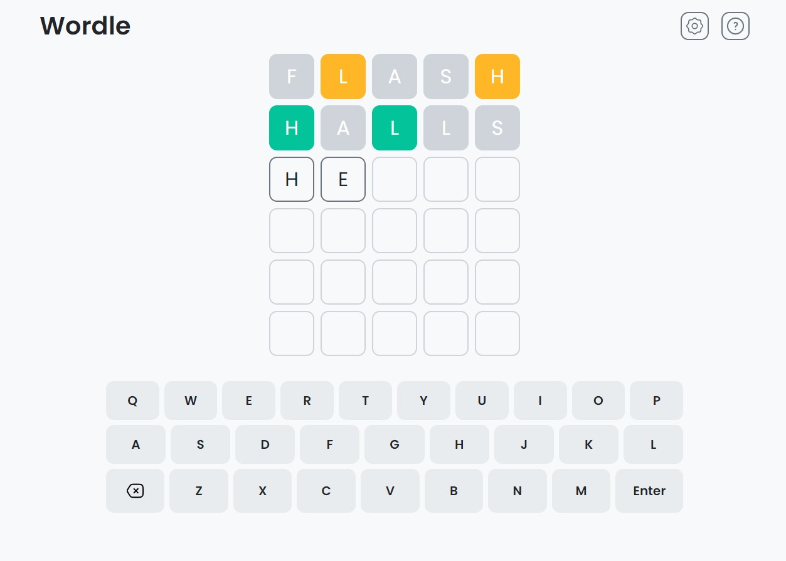

# Wordle Game

In this project, I attempted to create the well known WORDLE game. 
This is a game where you try to guess a word within 6 tries. An image of the website is given below.
You can play the game yourself using the link given below the image.

## Project

Play the Game Here - [Wordle](https://mdfarhan20.github.io/wordle-game/)

## Built With

- HTML
- CSS
- JavaScript
- APIs

### APIs used

- To fetch a random word - [Random Word API](https://random-word-api.herokuapp.com/home)
- To check if a word exists - [Dictionary API](https://dictionaryapi.dev/)

## About ME

- Website - [Mohamed Farhan](https://subsurf.netlify.app)
- Github - [mdfarhan20](https://github.com/mdfarhan20)
- LinkedIn - [Mohamed Farhan](https://www.linkedin.com/in/mohamed-farhan-201103cs/)
